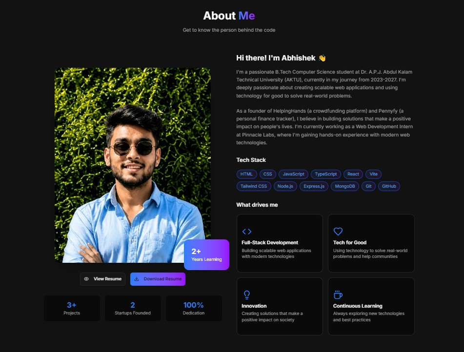

# Hi, I'm Abhishek Dwivedi 👋

  

### Full Stack Developer

React • Next.js • Node.js • TypeScript

Building scalable web applications and solving real-world problems through technology.

🌐 Portfolio: https://abhishekdwivedi-portfolio.vercel.app

💼 LinkedIn: https://www.linkedin.com/in/abhishekdwivedi29/

---

## 🚀 About Me

* 🎓 B.Tech in Computer Science & Engineering (AKTU)
* 💻 Full Stack Developer focused on modern web technologies
* 🌱 Currently learning System Design, DSA and scalable application architecture
* ⚡ Passionate about building impactful digital products
* 🎯 Looking for Software Development, Full Stack and Internship opportunities

---

## 🛠 Tech Stack

### Frontend

* React.js
* Next.js
* TypeScript
* JavaScript
* HTML5
* CSS3
* Tailwind CSS

### Backend

* Node.js
* Express.js

### Database

* MongoDB

### Tools & Platforms

* Git
* GitHub
* VS Code
* Figma
* Vercel

---

## 🌟 Featured Projects

### 🚍 TransitPulse

AI-powered public transport platform featuring live tracking, ETA prediction, crowd analytics and sustainability insights.

### 🤝 HelpingHands

Community-driven donation and support platform focused on connecting people with meaningful causes.

### 🌐 Portfolio Website

Personal portfolio showcasing projects, technical skills and development experience.

---

## 📈 Current Focus

* Advanced React & Next.js
* Backend Development with Node.js
* System Design Fundamentals
* Data Structures & Algorithms
* Full Stack Application Development

---

## 📫 Connect With Me

* Portfolio: https://abhishekdwivedi-portfolio.vercel.app
* LinkedIn: https://www.linkedin.com/in/abhishekdwivedi29/
* Email: [abhishekdwi455@gmail.com](mailto:abhishekdwi455@gmail.com)

---

🚀 Open to Software Development, Full Stack and Internship opportunities.
